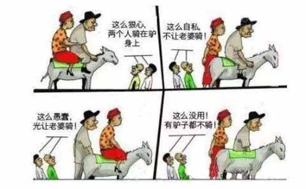

## 批判的同时一定要给出建设性意见吗？
链接:https://www.zhihu.com/question/375466123/answer/1941343333

由于批判太容易，没有建设性意见的批判是没有价值的。

批判的目的是什么？一般来说是改进。也就是越改越好。那什么叫改好？成本更低，利润更高，更符合伦理，更安全，更幸福，更有效率，更有性价比等等可以列出一大堆。

但是很多把批判的目的当成了减少批判，然而批判太容易，无论改不改，都能找出批判的角度，所以批判是无法减少的。

那么问题就来了，你批判了一件事或一个人，他改变了，改变后的他，你就会停止批判了吗？就算你给出了建议，他按照了你的建议走，做了很多改变，看到改变后的他，你会对其停止批判了吗?再我多年来的观察看，只因为批判而改变的，会得到更多批判；就算按照建议批判的，改变后，还是会有新的批判。如果你没有建设性的建议出来，改变后还是要被批判，还要承担改变后的成本和风险，那么为什么要为了减少批判而批判呢？你的批判又有多少价值。

所以：

批判很容易
根据批判的改变，改变后也同样会受到批判
做出改变需要巨大成本和承担巨大风险
因此最有收益的方式就是忽视没有价值的批判。没有建设性意见的批判，就是没有价值的批判

那么建设性意见的价值体现在那里.

- 第一，真的可以提升自己的利益，而不是为了减少批判。

- 第二，改变后，利益的提升，可以让自己忽视掉改变后受到批判的挫折

- 第三，有建设性的意见，就是让自己发现其中改变的成本和风险很低，收益却很大。

- 第四，有建设性的意见，让自己发现改变更符合自己的现实情况，比不改变收益更大。

所以对于被批判的一方来说，有着建设性意见的批判，才对自己有十足的价值。

--------

我再用经济学中的一个概念来解释，在经济学中有个机会成本的概念，所谓机会成本就是选择某一个收益之后，因而必须放弃另外一个收益。放弃的这个收益就是自己的机会成本了。

机会成本在我看来，就是你有着多个选择的选项，每个选项都对自己有一定的收益。作为理性人，你很容易从这些选项中，选择一个对收益最高最大的选项。

那么批判是什么，往往没价值的批判就是已经被自己筛选掉的选项而已，多少批判放到选项中来，做了个对比，最后我还是选我现在用的这个选项，毕竟收益对比下来，还是现在这个收益最高，你的批判我只能作为价值低的机会成本浪费掉了；又或者是，批判的东西，的确是我心向往的，但是完全超出了我的条件，让为完全没有办法把这个东西放到我的选项中去。既然没有选择，那你就是批判再多，我再怎么喜欢，我也没办法去选择，去做到的。

那么什么叫做建设性意见，就是增加了一个收益比十分可观的选项，并且自己完全可以去做到的。这个选项，要么收益远远超过了自己现在的选择；要么和现在的选择不相上下，发展潜力未来可期；或者单纯作为机会成本浪费会觉得可惜，这个选项值得思考去是否代替自己现在的选择。如此一来，就让一个本来一个对我完全没有意义的选项，突然变得对我来说十分有现实上意义了的选项。

当别人没有选择的时候，你的建议也做不成选项的时候，再多的批判又能怎么样？你无法让对方改变。只有给出建设性意见，把对方看不到的选项的展示给对方看，这样对方才能有做出改变的机会。